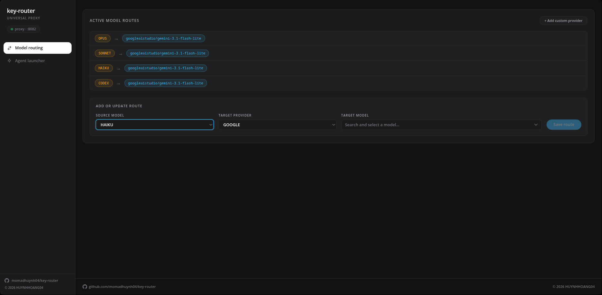

<div align="center">

  <h1>key-router</h1>
  <h3><strong>Claude Code + Codex — your models, your keys</strong></h3>

  <p>
    
    
    
    
    
    
    
  </p>

  <p>Local proxy that routes Claude Code and Codex to OpenRouter, DeepSeek, Google AI Studio or any OpenAI / Anthropic API — with full tool fidelity, thinking mode and streaming.</p>

  <p>
    <a href="#features">Features</a> •
    <a href="#quick-start">Quick Start</a> •
    <a href="#usage">Usage</a> •
    <a href="#configuration">Configuration</a> •
    <a href="#architecture">Architecture</a> •
    <a href="#project-structure">Project Structure</a>
  </p>

  <p>Language: <strong>English</strong> | <a href="#tiếng-việt">Tiếng Việt</a></p>

  <br/>

  
  <br/>
  <i>WebUI — Model routing, provider management, one-click launch</i>
  <br/><br/>
  
  <br/>
  <i>Claude Code routed through key-router to a DeepSeek backend</i>
</div>

---

## Features

| Feature | Description |
| ------- | ----------- |
| **Claude Code + Codex** | `POST /v1/messages` (Claude), `POST /v1/chat/completions` + `POST /v1/responses` (Codex ≥0.149, `additional_tools` / `namespace` / `custom:exec`). |
| **Multi-provider routing** | OpenRouter, DeepSeek (V3/V4 thinking), Google AI Studio, or any OpenAI/Anthropic endpoint. Ingress-aware: Claude → Anthropic, Codex → OpenAI passthrough. |
| **Thinking mode fixes** | DeepSeek V4 `reasoning_content` echo ([litellm#26395](https://github.com/BerriAI/litellm/issues/26395), [api-docs.deepseek.com/guides/thinking_mode](https://api-docs.deepseek.com/guides/thinking_mode/)) + Gemini `thoughtSignature` ([opencode#347](https://github.com/Gitlawb/openclaude/issues/347)). Multi-turn tool calls no longer 400. |
| **Full SSE streaming** | Token-by-token with Anthropic ↔ OpenAI translation and Responses typed events + agentic retry. |
| **Custom providers** | Any OpenAI/Anthropic API via WebUI or `python -m cli add-provider`. Keys by ENV name (`MY_API_KEY`), never raw. |
| **IDE auto-detect & launch** | VS Code, VSCodium, Cursor — sets `~/.claude/settings.json`, `~/.codex/config.toml`, `disableLoginPrompt`. |
| **WebUI** | React + Tailwind dashboard for routing, provider CRUD, IDE detection and launch. |
| **Cross-platform** | Windows / Linux / macOS. `start.sh` / `start.bat`, `dev.sh` / `dev.bat`. |

---

## Quick Start

### Prerequisites

- **Python 3.11+** · **Node.js 18+**
- API key for at least one provider: [OpenRouter](https://openrouter.ai/keys) · [DeepSeek](https://platform.deepseek.com/api_keys) · [Google AI Studio](https://aistudio.google.com)

> For the Claude Code VS Code extension, first install the CLI:
> ```bash
> npm install -g @anthropic-ai/claude-code
> ```

### 1. Install Claude Code & Codex

**Claude Code** (required for both CLI and VS Code extension):

```bash
# Node 18+ required
npm install -g @anthropic-ai/claude-code

# Verify — must print a version, not "command not found"
claude --version
# Also verify the native binary exists for the VS Code extension:
which claude   # Linux/macOS
where claude   # Windows — should point to claude.cmd
```

> The VS Code extension (`Anthropic Claude Code`) bundles its own CLI, but it requires the native `claude` binary to initialize. Without it the extension will fail even after proxy setup.

**Codex** (optional — for `gpt-5.6-sol`, `codex` etc.):

```bash
npm install -g @openai/codex
codex --version
# Codex authenticates via ~/.codex/config.toml — key-router writes it for you on launch.
```

### 2. Install key-router

```bash
git clone https://github.com/momadhuynh04/key-router.git
cd key-router

python -m venv venv
# Windows: venv\Scripts\activate
# Linux/macOS: source venv/bin/activate
pip install -r requirements.txt

cp .env.example .env   # then edit .env — add at least one key
```

**.env** — add the keys for the providers you will use:

```env
OPENROUTER_API_KEY="sk-or-v1-..."   # from https://openrouter.ai/keys
DEEPSEEK_API_KEY="sk-..."           # from https://platform.deepseek.com/api_keys
GOOGLE_API_KEY="AIza..."            # from https://aistudio.google.com/app/apikey
# custom providers: one ENV var per provider — referenced by name in UI/CLI
MY_API_KEY="sk-..."
```

### 3. Build WebUI

```bash
cd webui && npm install && npm run build && cd ..
# dev mode with HMR: ./dev.sh  (or dev.bat on Windows)
# In dev mode the frontend runs at http://localhost:5173
# while the backend stays at http://127.0.0.1:8082
```

### 4. Run

**Production** — single click, no auto-reload:

| Platform | Run | Stops with |
| -------- | --- | ---------- |
| Windows | `start.bat` | `Ctrl+C` |
| Linux / macOS | `./start.sh` | `Ctrl+C` |

What `./start.sh` / `start.bat` does: activates `venv`, runs `python -m cli.main` (uvicorn), waits for `:8082`, opens the browser.

**Manual** — same thing without the script:

```bash
# Activate venv first, then either:
uvicorn proxy.server:app --host 127.0.0.1 --port 8082
# or
python -m cli serve
# or directly
python -m cli.main   # no args → serves as well
```

**Development** — with hot-reload + HMR:

| Platform | Run | Backend | Frontend |
| -------- | --- | ------- | -------- |
| Windows | `dev.bat` | http://127.0.0.1:8082 (reload) | http://localhost:5173 (Vite) |
| Linux / macOS | `./dev.sh` | same | same |

`dev.sh`/`dev.bat` run `uvicorn --reload` and `npm run dev` in parallel.

After launch, open **http://127.0.0.1:8082** → continue to [Usage](#usage).

---

## Usage

### 1. Route models

**Model routing** tab → Source `Opus / Sonnet / Haiku / Codex` → Target provider → Target model → **Save route**. Persisted to `config.json`.

> Codex `gpt-5-codex` / `o3` / `codex` resolve via the `codex` family fallback. Set the **Codex** row to control the Codex backend.

### 2. Custom providers

**WebUI:** `+ Add custom provider` → ID (slug, `2-32` lowercase) → Display name → `OpenAI Compatible` or `Anthropic` → Base URL → API key **ENV name** (e.g. `MY_API_KEY`, raw `sk-...` stays in `.env`) → Models.

**CLI:**

```bash
export MY_API_KEY=sk-...
python -m cli add-provider --id my --display-name "MyAI" --api openai_compatible --base-url https://api.my.ai/v1 --api-key-env MY_API_KEY --model my-model:"My Model"
python -m cli list-providers
python -m cli remove-provider my
python -m cli list-models my
```

`GET /api/custom-providers` only returns `has_key`, never the raw key.

### 3. Launch

| Target | What it does |
| ------ | ------------ |
| **Claude Code (Terminal)** | Opens terminal with `ANTHROPIC_BASE_URL=http://127.0.0.1:8082` |
| **Codex** | Writes `~/.codex/config.toml` (`wire_api = "responses"`) and launches `codex` |
| **VS Code / VSCodium / Cursor** | Auto-detected via `PATH`, configures `~/.claude/settings.json` + IDE settings |

Then: `claude` · `codex` · or Spark icon in IDE.

> IDE not showing? Check `which code` / `where code` is in `PATH`, then run `detect-ide.sh` / `detect-ide.bat`.

---

## Configuration

| Variable | Required | Default |
| -------- | -------- | ------- |
| `OPENROUTER_API_KEY` | if using OpenRouter | — |
| `DEEPSEEK_API_KEY` | if using DeepSeek | — |
| `GOOGLE_API_KEY` | if using Google | — |
| `DEEPSEEK_BASE_URL_ANTHROPIC` | No | `https://api.deepseek.com/anthropic` |
| `DEEPSEEK_BASE_URL_OPENAI` | No | `https://api.deepseek.com` |
| `HOST` / `PORT` | No | `127.0.0.1` / `8082` |

**config.json** (via WebUI):

```json
{
  "model_mappings": {
    "opus": "openrouter/anthropic/claude-opus-4",
    "codex": "deepseekplatform/deepseek-v4-flash"
  }
}
```

**Auto-config files on launch:**

| File | Sets |
| ---- | ---- |
| `~/.claude/settings.json` | `env.ANTHROPIC_BASE_URL` + `ANTHROPIC_API_KEY` |
| `~/.codex/config.toml` | `model_provider = "key-router"` |
| `~/.config/<IDE>/User/settings.json` | `claudeCode.disableLoginPrompt: true` |

---

## Development

```bash
./dev.sh              # backend :8082 (reload) + frontend :5173 (HMR)
python -m pytest test/ -v
```

| Test file | Focus |
| --------- | ----- |
| `test_ide.py` · `test_server.py` · `test_models.py` | IDE, server, pydantic |
| `test_openai_base.py` · `test_openai_stream.py` · `test_events.py` | Translation & SSE |
| `test_codex_ingress.py` · `test_codex_responses.py` | Chat + Responses ingress |
| `test_config.py` · `test_codex_config.py` | Mapper, codex config |
| `test_openrouter.py` · `test_deepseek.py` | Adapters |

131 tests.

**Add a provider (code):** see [provider/CUSTOM_PROVIDER_GUIDE.md](provider/CUSTOM_PROVIDER_GUIDE.md) — inherit `OpenAIBaseProvider` or `BaseProvider`, register in `proxy/router.py`.

---

## Architecture

```
Claude Code  POST /v1/messages
Codex        POST /v1/responses  ─┐
Codex Chat   POST /v1/chat/completions ─┤→ proxy/app.py → routers/* → ModelMapper → ProviderRouter → provider
                                        └→ upstream (OpenRouter / DeepSeek V4 / Google / custom)
```

`proxy/server.py` is a thin `app = create_app()` — endpoints live in `proxy/routers/`.

## Project Structure

```
key-router/
├── proxy/            app, server, routers, ingress, errors, retry
├── provider/         base, openai_base, openrouter, deepseekplatform, googleaistudio, custom
├── models/           anthropic, openai_compat, events
├── config/           settings, model_map, codex_config, custom_providers
├── webui/            React + Tailwind (App.tsx, CustomProviderModal.tsx)
├── cli/              typer CLI (serve, add/list/remove provider)
├── test/             131 tests
└── start.sh / dev.sh
```

---

## Tiếng Việt

### Cài đặt

**1. Cài Claude Code & Codex**

```bash
npm install -g @anthropic-ai/claude-code   # bắt buộc — kể cả khi chỉ dùng extension VS Code
npm install -g @openai/codex               # nếu dùng Codex (gpt, codex...)
claude --version
codex --version
which claude   # Linux/macOS — kiểm tra binary có trong PATH
where claude   # Windows
```

> Extension VS Code `Anthropic Claude Code` cần binary `claude` native mới khởi động được — nếu thiếu, extension sẽ báo lỗi dù đã config proxy.

**2. Cài key-router**

```bash
git clone https://github.com/momadhuynh04/key-router.git
cd key-router

python -m venv venv
# Windows: venv\Scripts\activate
# Linux/macOS: source venv/bin/activate
pip install -r requirements.txt

cp .env.example .env
# mở .env bằng notepad/vscode, dán key của provider sẽ dùng:
# OPENROUTER_API_KEY="sk-or-v1-..."
# DEEPSEEK_API_KEY="sk-..."
# GOOGLE_API_KEY="AIza..."
# custom: MY_API_KEY="sk-..." (mỗi provider 1 biến)
```

**3. Build WebUI**

```bash
cd webui && npm install && npm run build && cd ..
# dev có hot-reload: ./dev.sh (Windows: dev.bat)
# dev chạy backend :8082 + frontend :5173 (Vite HMR)
```

**4. Chạy**

| Chế độ | Windows | Linux / macOS | Ghi chú |
| ------ | ------- | ------------- | ------- |
| **Production** | `start.bat` | `./start.sh` | Bấm là chạy, bấm `Ctrl+C` để dừng. Script tự kích hoạt venv, chạy `python -m cli.main`, đợi `:8082` rồi mở browser. |
| **Manual** | `venv\Scripts\activate` rồi `python -m cli serve` hoặc `uvicorn proxy.server:app --host 127.0.0.1 --port 8082` | `source venv/bin/activate` rồi tương tự | Cùng hiệu quả như script — dùng khi debug. |
| **Development** | `dev.bat` | `./dev.sh` | Chạy `uvicorn --reload` + `npm run dev` song song. |

Sau khi chạy, mở **http://127.0.0.1:8082**.

### Cấu hình

Vào tab **Model routing**: `Opus / Sonnet / Haiku / Codex` → chọn **Target provider** (OpenRouter / DeepSeek / Google / custom) → chọn **Target model** → **Save route**. Đã fix sẵn `reasoning_content` của DeepSeek V4 và `thoughtSignature` của Google nên không còn lỗi 400 khi gọi tool nhiều vòng.

Tab **Agent launcher**: **Claude Code** mở terminal đã set `ANTHROPIC_BASE_URL`, **Codex** tự ghi `~/.codex/config.toml`, **VS Code / Cursor / VSCodium** tự detect qua `PATH` — bấm là chạy.

**Custom provider:** bấm **+ Add custom provider** → điền ID, Base URL (`https://api.xxx/v1`), API key **tên biến ENV** (ví dụ `MY_API_KEY`) — nhớ thêm `MY_API_KEY=sk-...` vào `.env` rồi restart. Hoặc CLI `python -m cli add-provider ...` như bản tiếng Anh.

**Gặp lỗi:** IDE không hiện → chạy `detect-ide.bat` / `./detect-ide.sh`, kiểm tra `where code` / `which code` có trong PATH không.

---

## License

MIT — see [LICENSE](LICENSE). © 2026 [huynhhoang04](https://github.com/momadhuynh04)
